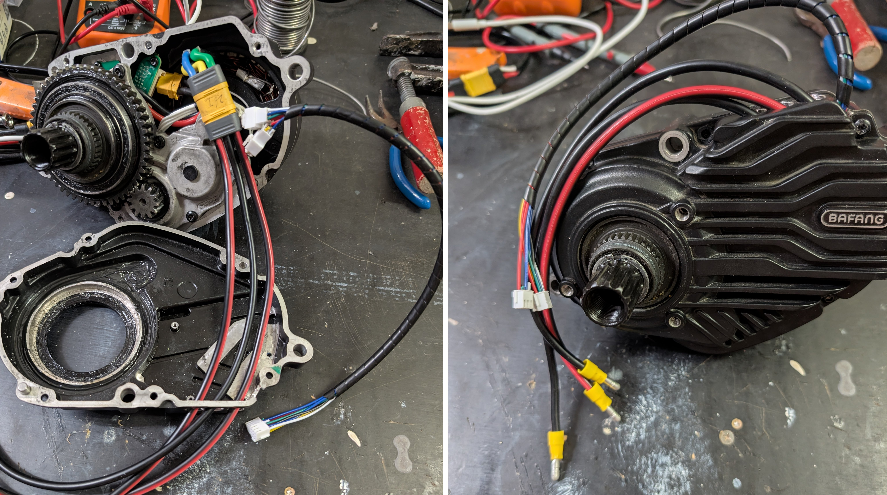
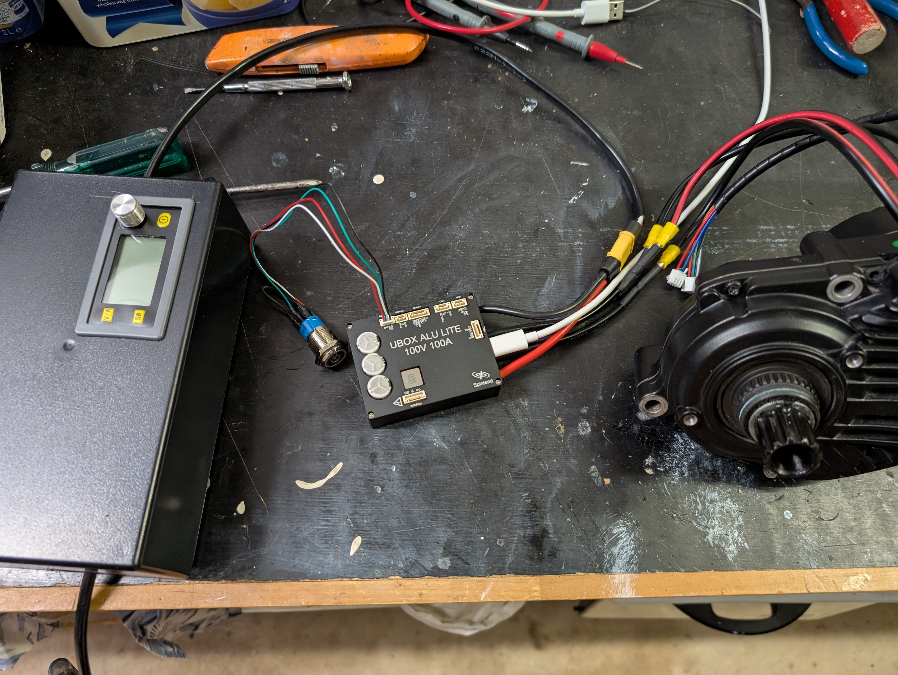
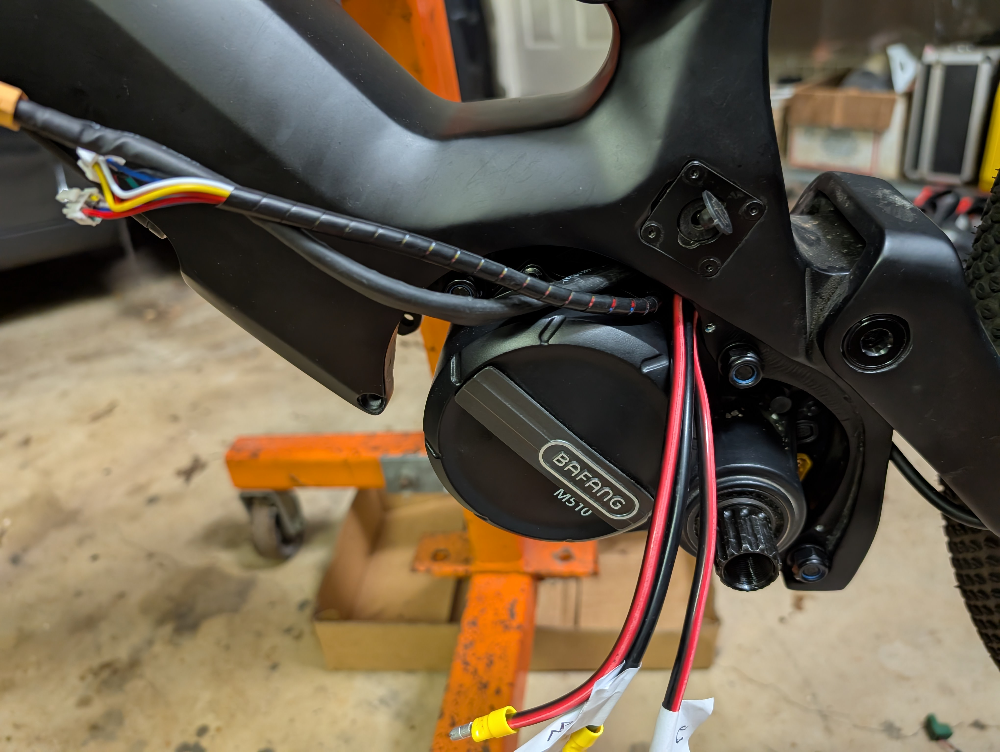
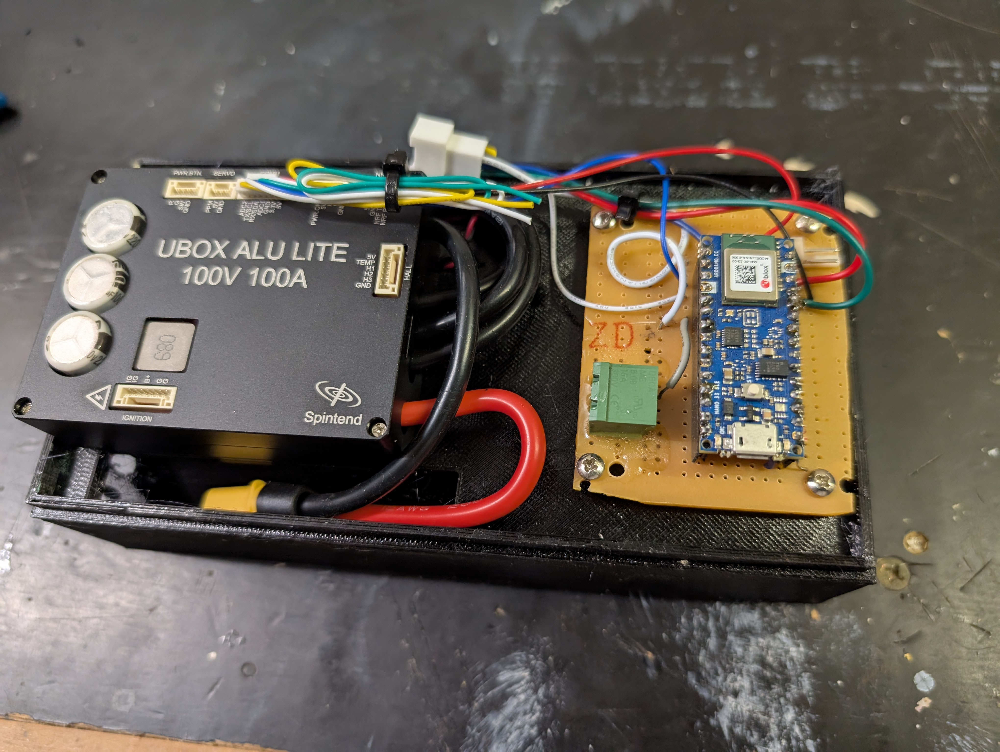
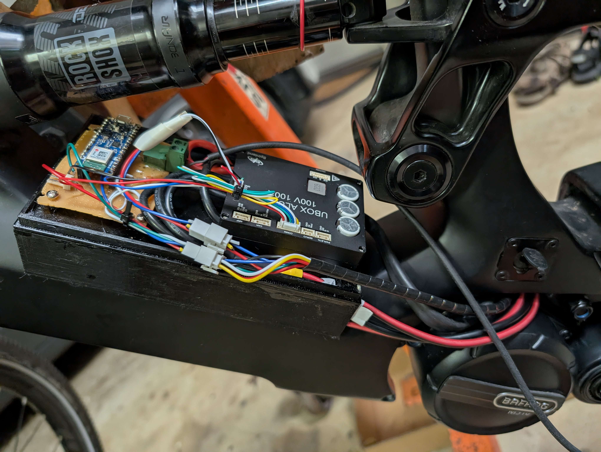
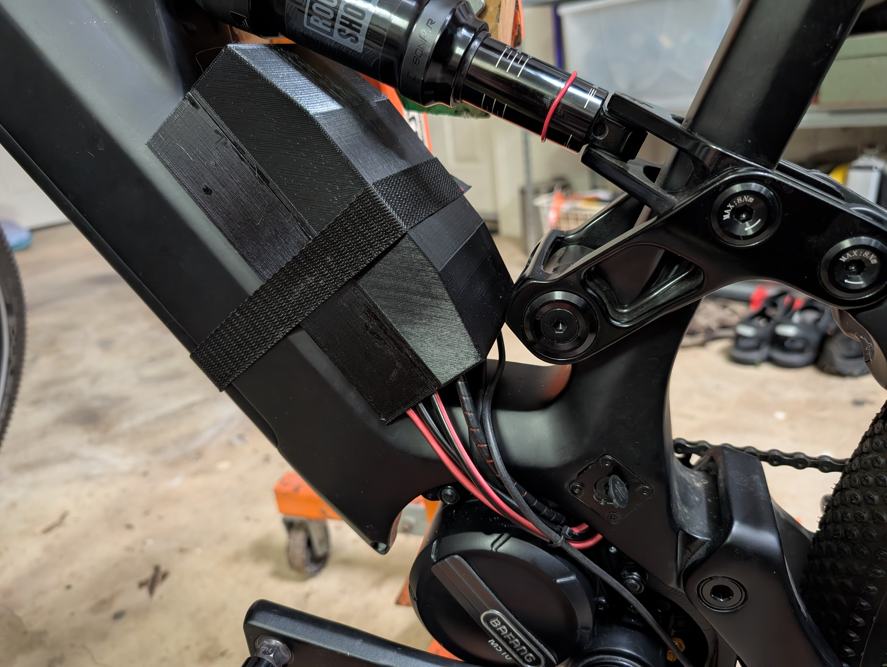

# Farnsworth

"i can wire anything into anything!!" - Prof. Hubert J Farnsworth

### Control VESC motor by pedelec and display data via BLE

This version is for Bafang M510 and other mid motors that have an analog torque sensor and quadrature cadence sensors. 

### Scope

To allow gutted (motor only) Bafang mid motors to be controlled by an externally mounted VESC, and allow users to have full control. It addionally outputs speed, cadence and power data via the BLE Cycle Power service to popular cycling apps (such as SuperCycle), or full motor parameters to the [Babelfish app for VESC](https://github.com/gilesp1729/Babelfish).

### Sensors used

* 6-pin analog torque/cadence sensor in M510 or M560 motor (the CAN bus ones are not supported)

* 2-pin temp sensor (there are no Hall sensors in these motors)

* Speed sensor (I used a Bosch one because it's much easier being only 2-wire, but any active-low sensor would do)

### Runs on

Arduino Nano 33 BLE or BLE Sense.

### Library dependencies

* VESCUart

* ArduinoBLE

* RunningAverage

### Works in progress

* Enforce the speed limit.

* Experiment with run-on time to get smooth running through brief pauses in pedalling.

* Display using Babelfish needs to be able to set and write the PAS level to Farnsworth, among other things.

* Electrical noise during motor startup (open-loop running of sensorless motor) is confusing the speed and cadence readings. Placing a 0.1uf cap to ground on both inputs cured the speed noise, but the cadence noise is not fully cured.I suspect this is caused by its closer proximity to the phase wires. Using shielded cables may help but that's for the next pull-down.

The schematics will be published when the noise-suppression stuff gets sorted out.

In the meantime here are some pictures of the  build.

The phase wires and the torque sensor/temp sensor wires come out of the top of the motor housing.  The sensor wires use [PHB2.0mm 2x3P](https://www.aliexpress.com/item/1005009108741866.html?spm=a2g0o.productlist.main.29.b94171f8BYGM0M&algo_pvid=40b2e60a-478e-4b6b-92ec-0545aff7575f&algo_exp_id=40b2e60a-478e-4b6b-92ec-0545aff7575f-28&pdp_ext_f=%7B%22order%22%3A%221%22%2C%22eval%22%3A%221%22%2C%22fromPage%22%3A%22search%22%7D&pdp_npi=6%40dis%21AUD%216.39%216.39%21%21%214.22%214.22%21%40210328d417685465333963613e9c7c%2112000048990107648%21sea%21AU%210%21ABX%211%210%21n_tag%3A-29910%3Bd%3A2ccc2a2e%3Bm03_new_user%3A-29895&curPageLogUid=KmfU7wbF0YEX&utparam-url=scene%3Asearch%7Cquery_from%3A%7Cx_object_id%3A1005009108741866%7C_p_origin_prod%3A) plugs while the phases use an MR60 plug inside the motor and 4mm bullet pins to interface with the VESC.

Testing the motor with the [Spintend Ubox 100V/100A Vesc](https://spintend.com/collections/esc-based-on-vesc/products/single-ubox-aluminum-controller-100v-100a-based-on-vesc). On the left is a cheap [20 amp buck converter]([Buy CNC Adjustable Power Supply (20A 1200W, LCD Display) Online | Kogan.com](https://www.kogan.com/au/buy/connecttriad-cnc-adjustable-power-supply-20a-1200w-lcd-display-is34049-1-ctxxy-0515/?utm_campaign=postsaleorderconfirm&utm_medium=email&utm_source=kogan)) that takes 48V in from the battery and allows current limiting and reduced voltage for testing.

The wires are led out on the left side, since it's the only place the gap is large enough without cutting the carbon fibre (which I was not going to do)

The VESC and Arduino Nano 33BLE mounted on the 3D-printed cradle. This is shaped to fit the frame just below the shock and has a gap below for a small heatsink (from an old graphics card) stuck on the VESC. The VESC runs cool.

Like this.

The lid is made in two halves so it can be slipped in under the shock.
